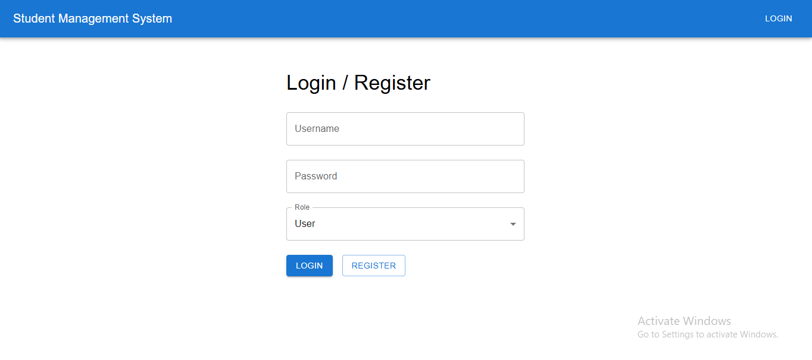
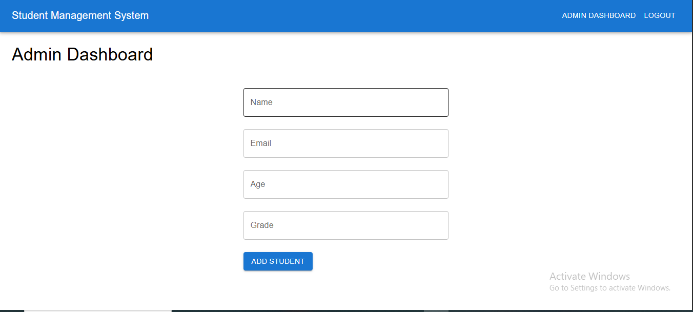
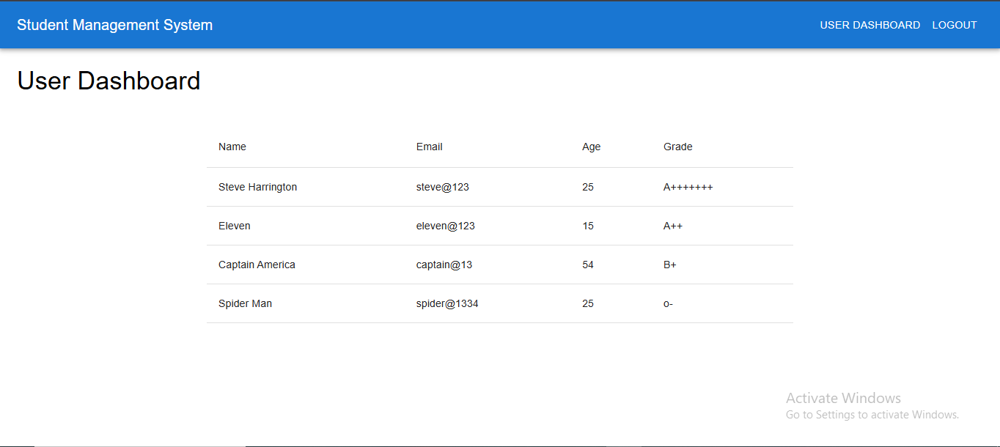

<h1>Student Management System</h1>

A full-stack web application for managing student records with role-based access control, a responsive dashboard, and a RESTful API. Built with <strong>React</strong>, <strong>Node.js</strong>, <strong>Express</strong>, and <strong>MongoDB</strong>, this project implements a CRUD system with secure authentication using JSON Web Tokens (JWT).

<h2 id="features">Features</h2>

<ul>
        <li><strong>Role-Based Access Control</strong>:
            <ul>
                <li><strong>Admin</strong>: Full CRUD (Create, Read, Update, Delete) operations for student records.</li>
                <li><strong>User</strong>: Read-only access to view student records.</li>
            </ul>
        </li>
        <li><strong>Responsive UI</strong>: Modern, mobile-friendly dashboard built with Material-UI.</li>
        <li><strong>Authentication</strong>: Secure user registration and login using JWT.</li>
        <li><strong>CRUD Operations</strong>: Manage student details (name, email, age, grade) via a RESTful API.</li>
        <li><strong>Dynamic Dashboards</strong>: Separate interfaces for admin and user roles.</li>
        <li><strong>Error Handling</strong>: Basic input validation and error messaging for user interactions and API requests.</li>
    </ul>

<h2 id="tech-stack">Tech Stack</h2>
    <ul>
        <li><strong>Frontend</strong>:
            <ul>
                <li>React </li>
                <li>Material-UI </li>
                <li>Axios (for API requests)</li>
                <li>React Router (for navigation)</li>
            </ul>
        </li>
        <li><strong>Backend</strong>:
            <ul>
                <li>Node.js</li>
                <li>Express</li>
                <li>MongoDB</li>
                <li>Mongoose</li>
                <li>JSON Web Tokens (JWT) for authentication</li>
                <li>Bcrypt.js for password hashing</li>
            </ul>
        </li>
        <li><strong>Environment</strong>:
            <ul>
                <li>MongoDB (local)</li>
                <li>Node.js runtime</li>
            </ul>
        </li>
    </ul>

<h2 id="project-structure">Project Structure</h2>
<pre><code>
student-management-system/
├── backend/
│   ├── config/
│   │   └── db.js              # MongoDB connection setup
│   ├── models/
│   │   ├── User.js            # User schema (username, password, role)
│   │   └── Student.js         # Student schema (name, email, age, grade)
│   ├── routes/
│   │   ├── auth.js            # Authentication routes (register, login)
│   │   └── student.js         # Student CRUD routes
│   ├── middleware/
│   │   └── auth.js            # JWT authentication middleware
│   ├── .env                   # Environment variables
│   ├── server.js              # Express server entry point
│   └── package.json           # Backend dependencies
├── frontend/
│   ├── src/
│   │   ├── components/
│   │   │   ├── Login.js       # Login and registration form
│   │   │   ├── Navbar.js      # Navigation bar
│   │   │   ├── StudentForm.js # Form for creating/updating students
│   │   │   └── StudentList.js # Table to display students
│   │   ├── pages/
│   │   │   ├── Home.js        # Home page (login/register)
│   │   │   ├── AdminDashboard.js # Admin dashboard
│   │   │   └── UserDashboard.js  # User dashboard
│   │   ├── App.js             # Main app with routing
│   │   ├── App.css            # Basic styles
│   │   └── index.js           # React entry point
│   └── package.json           # Frontend dependencies
├── README.md                  # Project documentation
</code></pre>

<h2 id="usage">Usage</h2>
    <ol>
        <li><strong>Register Users</strong>:
            <ul>
                <li>Navigate to the home page (<code>/</code>) and register an <strong>admin</strong> user (e.g., username: <code>admin1</code>, password: <code>password</code>, role: <code>admin</code>).</li>
                <li>Register a <strong>user</strong> (e.g., username: <code>user1</code>, password: <code>password</code>, role: <code>user</code>).</li>
            </ul>
        </li>
        <li><strong>Log In</strong>:
            <ul>
                <li>Log in as an admin to access the Admin Dashboard (<code>/admin</code>).</li>
                <li>Log in as a user to access the User Dashboard (<code>/user</code>).</li>
            </ul>
        </li>
        <li><strong>Admin Actions</strong>:
            <ul>
                <li>Use the Admin Dashboard to add, edit, or delete students (e.g., name: <code>John Doe</code>, email: <code>john@example.com</code>, age: <code>20</code>, grade: <code>A</code>).</li>
                <li>Verify that the student list updates dynamically.</li>
            </ul>
        </li>
        <li><strong>User Actions</strong>:
            <ul>
                <li>Use the User Dashboard to view the student list (read-only, no edit/delete options).</li>
            </ul>
        </li>
        <li><strong>Test Responsiveness</strong>:
            <ul>
                <li>Resize the browser or test on a mobile device to confirm the UI adapts to different screen sizes.</li>
            </ul>
        </li>
    </ol>

<h2 id="api-endpoints">API Endpoints</h2>
    <h3>Authentication</h3>
    <ul>
        <li><strong>POST</strong> <code>/api/auth/register</code>
            
Register a new user.

            
<strong>Body</strong>: <code>{ "username": "string", "password": "string", "role": "admin|user" }</code>

            
<strong>Response</strong>: <code>{ "token": "jwt_token" }</code>

        </li>
        <li><strong>POST</strong> <code>/api/auth/login</code>
            
Log in a user.

            
<strong>Body</strong>: <code>{ "username": "string", "password": "string" }</code>

            
<strong>Response</strong>: <code>{ "token": "jwt_token", "role": "admin|user" }</code>

        </li>
    </ul>

<h3>Students (Protected Routes)</h3>
    <ul>
        <li><strong>POST</strong> <code>/api/students</code> (Admin only)
            
Create a new student.

            
<strong>Headers</strong>: <code>{ "Authorization": "Bearer &lt;token&gt;" }</code>

            
<strong>Body</strong>: <code>{ "name": "string", "email": "string", "age": number, "grade": "string" }</code>

            
<strong>Response</strong>: <code>{ "student": { ... } }</code>

        </li>
        <li><strong>GET</strong> <code>/api/students</code> (Admin/User)
            
Get all students.

            
<strong>Headers</strong>: <code>{ "Authorization": "Bearer &lt;token&gt;" }</code>

            
<strong>Response</strong>: <code>[ { "student": { ... } }, ... ]</code>

        </li>
        <li><strong>PUT</strong> <code>/api/students/:id</code> (Admin only)
            
Update a student.

            
<strong>Headers</strong>: <code>{ "Authorization": "Bearer &lt;token&gt;" }</code>

            
<strong>Body</strong>: <code>{ "name": "string", "email": "string", "age": number, "grade": "string" }</code>

            
<strong>Response</strong>: <code>{ "student": { ... } }</code>

        </li>
        <li><strong>DELETE</strong> <code>/api/students/:id</code> (Admin only)
            
Delete a student.

            
<strong>Headers</strong>: <code>{ "Authorization": "Bearer &lt;token&gt;" }</code>

            
<strong>Response</strong>: <code>{ "message": "Student deleted" }</code>

        </li>
    </ul>

<h2 id="screenshots">Screenshots</h2>
    
<em>Add screenshots to showcase the application. Example placeholders:</em>

    <ul>
        <li><strong>Login Page</strong>: </li>
        <li><strong>Admin Dashboard</strong>: </li>
        <li><strong>User Dashboard</strong>: </li>
    </ul>

<h2 id="contributing">Contributing</h2>
    
Contributions are welcome! To contribute:

    <ol>
        <li>Fork the repository.</li>
        <li>Create a new branch (<code>git checkout -b feature/your-feature</code>).</li>
        <li>Make changes and commit (<code>git commit -m "Add your feature"</code>).</li>
        <li>Push to the branch (<code>git push origin feature/your-feature</code>).</li>
        <li>Open a Pull Request.</li>
    </ol>
    
Please follow the existing code style and include tests where applicable.

